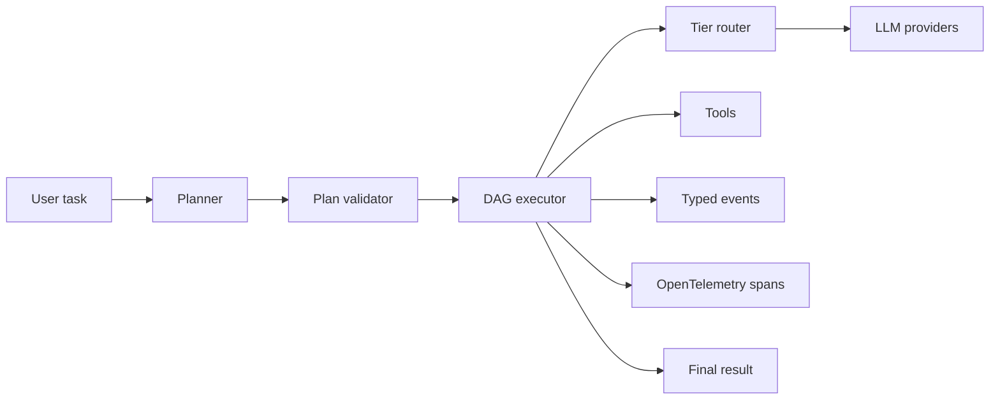

# Spec: Product website

## Purpose

Build a public website that frames Glassrail as reliability infrastructure for
agentic workflows. The site should help a serious AI infrastructure reviewer
understand why the project exists, what is technically different, how to try it,
and why the work is credible.

The marketing lens is important: Glassrail should not read like another chatbot
wrapper. It should read like a system for making probabilistic model behavior
observable, validated, repeatable, and safer to operate.

## Positioning

Glassrail is an infrastructure layer for auditable agentic workflows.

It turns a task into a validated DAG of typed nodes, executes each node with
fresh declared context, routes model calls through deterministic provider tiers,
and exposes traces, events, approval points, and evals around the whole run.

The core message:

> Agentic systems need rails you can inspect. Glassrail makes model-driven work
> observable, testable, and harder to fake.

## Audience

- AI infrastructure engineers at frontier labs, startups, and big tech orgs.
- Agent framework users who are frustrated by opaque loop behavior.
- Hiring reviewers looking for evidence of serious AI systems taste.
- OSS contributors who care about evals, traces, planning, routing, and safety.

## Non-goals

- A heavy enterprise sales site.
- A generic AI landing page full of vague productivity claims.
- A replacement for technical docs.
- A claim that Glassrail is production-hardened for arbitrary workloads today.

## MVP information architecture

### Home

The home page should make the project legible in one screen:

- Name: Glassrail.
- Category: reliability infrastructure for agentic workflows.
- One concise value statement.
- Install or try command.
- Link to GitHub.
- Link to docs.
- A small eval status table or badge.
- A compact architecture snapshot.

The first page should show substance quickly. Avoid a hero that only says the
project is "powerful" or "next generation". The differentiator is the system
shape: validated DAGs, fresh context, deterministic routing, telemetry, evals.

### Why DAG planning?

Explain the failure mode Glassrail is designed around:

- Opaque agent loops are hard to inspect.
- Tool use can become difficult to audit.
- Model choice can become implicit and expensive.
- Long context can hide stale or irrelevant information.
- Final answers can be hard to connect back to the work that produced them.

Then explain the Glassrail bet:

- Make the plan explicit.
- Validate the graph before execution.
- Give each node only the context it asked for.
- Route models deterministically.
- Emit events and traces.
- Measure behavior with evals.

### Evals

Publish the current release gate results and methodology. The page should link
to `docs/evals.md` for detail and show enough data to be trusted:

| Suite | Latest release-gate result |
|---|---|
| harness-mechanics | 32/32 full-pass |
| node-capability-openrouter | 7/7 full-pass |
| glassrail-openrouter | 20/23 full-pass |

Also state the remaining known ratchet: result-node preservation of comparison
axes, named candidates, and caveats.

### Architecture

The architecture page should show the core flow:

The copy should stay focused on operational reliability. The interesting thing
is not that Glassrail calls a model; it is that it wraps model behavior in a
typed plan, validation, execution semantics, routing, approvals, telemetry, and
regression evals.

### Quickstart

The website quickstart should be shorter than the README:

- Install command.
- Configure one model tier.
- Run one task.
- Link to full configuration docs.

### Roadmap

Link to the repo roadmap and call out what is intentionally not stable yet.
This earns trust. It also sets up future posts around file editing, HITL,
registry schemas, and richer TUI workflows.

## Technical plan

Use the existing MkDocs + Material stack for the first product website. It is
already in the repository, already part of CI, and keeps docs close to code.

Required implementation work:

- Confirm `mkdocs.yml` `site_url`, `repo_url`, and `repo_name` match the
  canonical website and GitHub repo.
- Decide the canonical domain.
- Configure GitHub Pages or another static host.
- Add website-oriented copy to `docs/index.md`.
- Add a compact eval status section that links to `docs/evals.md`.
- Add any new pages to `mkdocs.yml` nav.
- Add the website URL to `pyproject.toml` project URLs after it is live.
- Add the website URL to the README.

## Design direction

The site should feel like infrastructure, not SaaS theater:

- Clear typography.
- Sparse claims.
- Real diagrams and tables.
- Direct links to source, evals, and roadmap.
- Minimal decorative styling.
- No vague AI imagery.

The tone should be confident but measured: "this is the reliability thesis and
here is the evidence so far", not "this solves agents forever".

## Launch assets

Before linking the website broadly, prepare:

- One short architecture diagram.
- One eval gate table.
- One installation snippet.
- One screenshot or terminal capture of a run if it adds clarity.
- A short "Why Glassrail?" paragraph that can be reused in launch posts.

## Acceptance criteria

- Website builds with `uv run mkdocs build --strict`.
- Website is published at the canonical URL.
- Homepage clearly says what Glassrail is and why DAG planning matters.
- Install path is visible from the homepage.
- Eval status is visible and linked to methodology.
- GitHub, PyPI, README, and docs point at each other correctly.
- Known limitations are stated without apology or hype.

## Sequencing

The product website should launch after PyPI is live or in the same release
window. If the package is not installable yet, the site can exist as docs, but
grassroots marketing should wait until the install path is clean.
